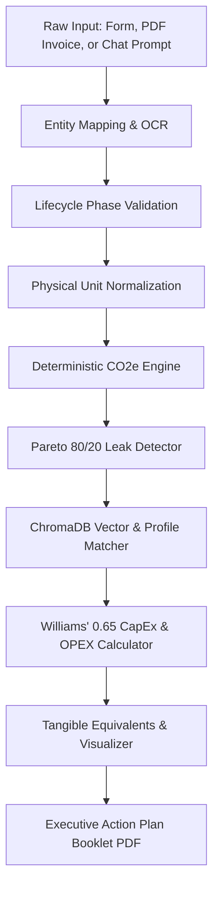

# EcoLeak — Technical Architecture, Product Working & Jargon Guide

> **Official Product & Engineering Dossier**  
> Prepared for Stakeholder Presentations, Hackathon Juries, and Technical Leadership.  
> *Target Audience: Engineers, investors, sustainability consultants, plant managers, and curious non-experts.*

---

## 1. Executive Summary: What is EcoLeak?

**EcoLeak** is an **Industrial Decarbonization Intelligence & Circular Economy Platform** engineered specifically for factories, manufacturing facilities, and industrial Small-to-Medium Enterprises (SMEs).

### The Problem EcoLeak Solves
Industrial manufacturing produces over **30% of global greenhouse gas emissions**. While multi-national corporations have multimillion-dollar ESG audit consultants, small and mid-sized factories suffer from:
1. **The "Black Box" Problem:** Plant operators receive utility bills, fuel invoices, and polymer deliveries, but have no clear idea *which specific sub-processes leak the most carbon*.
2. **Abstract Math & Paralysis:** Carbon reports output numbers like `"342 tCO₂e"`, which mean virtually nothing to a plant engineer whose primary daily metrics are production yield, line uptime, and rupees spent.
3. **Linear Waste Bleed:** Virgin raw materials (virgin PET, virgin HDPE, blast furnace steel) are purchased, processed once, and scrap trim or thermal exhaust is dumped as waste, haemorrhaging cash.
4. **LLM Hallucination Risk:** Generic AI tools often hallucinate non-existent emission factors or perform erroneous calculations on physical units, which can result in severe statutory non-compliance or plant failure.

### EcoLeak's Solution
EcoLeak inverts this paradigm with a **"Deterministic-First" Engine**:
- **Automatic Ingestion:** Natural language descriptions, structured activity forms, or raw utility PDF invoices (in 22+ Indic languages via Sarvam AI & PyMuPDF).
- **Leak-Point Isolation:** Automatically classifies Scope 1, Scope 2, and Scope 3 emissions, isolates top leak points via the **Pareto 80/20 Rule**, and provides interactive visual graphs.
- **Closed-Loop Engineering:** Recommends verified circular replacements (e.g., Virgin PET $\to$ Food-Grade rPET regrind, Grid electricity $\to$ Rooftop Solar wheeling + VFDs).
- **Tangible Equivalents & Hard Numbers:** Converts abstract metric tons into tangible metrics (*"taking 21 cars off the road for a year"*, *"planting 1,600 trees"*) and computes capital expenditures using physical engineering laws (Williams' 0.65 Rule) and payback periods in **Indian Rupees (₹ INR)**.
- **Publication-Ready Custom Booklet:** Instantly generates a boardroom-ready, multi-page vector PDF action plan booklet with compliance sign-offs for SPCB, CPCB, ISO 14064-1, SEBI BRSR, and EU CBAM.

---

## 2. Core Architectural Philosophy: "Deterministic First"

One of EcoLeak's most foundational engineering decisions is the **absolute separation of linguistic intelligence from mathematical computation**:

```
 ┌──────────────────────────────────────────────────────────┐
 │               Natural Language / Document Ingestion       │
 │   Groq (openai/gpt-oss-120b) / Gemini 3.6 / Sarvam AI    │
 └────────────────────────────┬─────────────────────────────┘
                              │ Extracted Entities & Quantities
                              ▼
 ┌──────────────────────────────────────────────────────────┐
 │          EcoLeak Deterministic Local Python Engine       │
 │  • Physical Unit Conversions & Dimensional Auditing      │
 │  • Carbon Calculations: Q × EF (Zero LLM Arithmetic)     │
 │  • Pareto 80/20 Cumulative Distribution Hotspots         │
 │  • Williams' 0.65 Rule Dynamic CAPEX Scaling             │
 │  • OPEX Savings & Amortized Payback Months               │
 └────────────────────────────┬─────────────────────────────┘
                              │ Audit-Ready Data Models
                              ▼
 ┌──────────────────────────────────────────────────────────┐
 │             Interactive Frontend Visualization           │
 │  • Pareto 80/20 Dual-Axis Curve & GHG Scopes Donut       │
 │  • Live Before/After Circular Scrub Bench                │
 │  • Custom Multi-Page Booklet PDF Exporter                │
 └──────────────────────────────────────────────────────────┘
```

> **CRITICAL INVARIANT:**  
> **LLMs are NEVER permitted to perform arithmetic, estimate carbon emissions, compute financial ROI, or generate numerical emission factors.**

- **The LLM Domain:** Language models are strictly restricted to reading text, parsing documents, and translating unstructured operator notes into structured keys and quantities.
- **The Deterministic Domain:** 100% of mathematical formulas, unit checks (e.g., density conversions of liters of diesel to kg), Pareto rankings, and monetary equations are calculated deterministically by local Python services (`emission_engine.py`, `circular_engine.py`, `leak_detector.py`).

---

## 3. How EcoLeak Works: Step-by-Step Pipeline



### Step 1: Input Ingestion
Plant operators can provide operational data through three modes:
1. **Direct Form Inputs:** Enter monthly kWh of electricity, liters of fuel, kilograms of raw polymer/metal, and waste generated.
2. **Utility Invoice & Document Scanner:** Upload PDF electricity utility bills, fuel vouchers, or raw material delivery receipts. Indic OCR (Sarvam AI DocAgent) extracts tables across 22 Indian languages, with PyMuPDF fallback.
3. **Conversational Copilot:** Type natural language factory descriptions:  
   *e.g., "We run an injection moulding line in Pune using 25,000 kWh grid power, 600L diesel in our DG set, and 45 tons of virgin PP resin."*

### Step 2: Physical Unit Normalization & Dimensional Checking
Units vary widely across facilities: kWh, MWh, Liters, Gallons, Kilograms, Metric Tonnes, or Cubic Meters ($m^3$).  
EcoLeak normalizes all quantities into canonical base units:
$$\text{Mass: } \text{kg} \quad | \quad \text{Liquid Volume: } \text{L} \quad | \quad \text{Gas Volume: } m^3 \quad | \quad \text{Electricity: } \text{kWh}$$

Cross-dimensional conversions (e.g., fuel mass in kg to volume in liters) strictly enforce physical properties:
$$\text{Volume (L)} = \frac{\text{Mass (kg)}}{\text{Density } (\text{kg/L})} \quad \left(\text{Diesel: } 0.84 \text{ kg/L}\right)$$
Every conversion logs an explicit audit trail in the response schema.

### Step 3: Deterministic Emission Calculation ($Q \times EF$)
Emissions are calculated using standard IPCC, Central Electricity Authority (CEA) India, and GHG Protocol factors:
$$E = Q \times EF$$
Where:
- $E$ = Total emissions ($\text{kg CO}_2\text{e}$)
- $Q$ = Normalized activity quantity
- $EF$ = Canonical emission factor ($\text{kg CO}_2\text{e}$ per base unit)

Activities are categorized into **Scope 1** (Direct on-site combustion), **Scope 2** (Purchased electricity), and **Scope 3** (Upstream raw material extraction & waste).

### Step 4: Pareto 80/20 Emission Leak Detection
The engine isolates the top emission hotspots using the **Pareto Principle**:
1. Activities are sorted descending by emissions magnitude ($E_1 \ge E_2 \ge \dots \ge E_n$).
2. Running cumulative percentage share is computed:
   $$C_k = \frac{\sum_{i=1}^k E_i}{E_{\text{total}}} \times 100\%$$
3. Any process where $C_k \le 80\%$ is classified as a **Critical Hotspot / Primary Leak Point**. This tells the plant manager: *"Fixing these 2 items addresses 80% of your total plant footprint."*

### Step 5: Circular Economy Recommendation & Williams' Rule Scaling
For each identified leak point, EcoLeak retrieves verified circular alternatives from ChromaDB vector search and local engineering catalogs:
- **Virgin Material Substitution:** Virgin PET $\to$ 100% Food-Grade rPET Regrind.
- **Energy Waste Recovery:** Boiler thermal exhaust $\to$ Waste Heat Economizer & Biomass Co-firing.
- **Dynamic CapEx Scaling (Williams' 0.65 Rule):**  
  Chemical and industrial plant capital costs do not scale linearly with capacity; they scale non-linearly according to the six-tenths / 0.65 capacity law:
  $$\text{CAPEX}_{\text{scaled}} = \text{CAPEX}_{\text{base}} \times \left(\frac{\text{Capacity}_{\text{actual}}}{\text{Capacity}_{\text{base}}}\right)^{0.65}$$
- **OPEX Savings & Payback Calculation:**
  $$\text{Annual OPEX Savings (₹)} = \text{Quantity} \times (\text{Price}_{\text{virgin}} - \text{Price}_{\text{circular}}) \times 12$$
  $$\text{Payback Period (Months)} = \frac{\text{CAPEX}}{\text{Annual OPEX Savings}} \times 12$$

### Step 6: Tangible Impact Equivalents
To make abstract metrics like `120 tCO₂e` immediately understandable to boards and stakeholders, EcoLeak computes real-world equivalents:
- **Passenger Cars Removed:** $\frac{\text{kg CO}_2\text{e}}{4,600 \text{ kg/car/year}}$
- **Mature Trees Planted:** $\frac{\text{kg CO}_2\text{e}}{21.77 \text{ kg/tree/year}}$
- **Barrels of Crude Oil Offset:** $\frac{\text{kg CO}_2\text{e}}{430 \text{ kg/barrel}}$
- **Indian Household Electricity Months:** $\frac{\text{kg CO}_2\text{e}}{164 \text{ kg/home/month}}$

### Step 7: Executive Custom Booklet Generation
Rather than triggering a raw browser print window, EcoLeak compiles an executive multi-page dossier (`ActionPlanBookletModal.jsx`) formatted as an official corporate publication, complete with CTO regulatory registration, Pareto charts, equipment CapEx matrices, and signatory verification.

---

## 4. The Complete Industrial & Sustainability Jargon Dictionary

For a complete newcomer, industrial carbon accounting contains dozens of confusing terms. Here is the authoritative reference guide:

### A. Carbon & Greenhouse Gas (GHG) Metrics

| Term | Full Name | Clear Explanation | Practical Factory Example |
|---|---|---|---|
| **$\text{CO}_2$** | Carbon Dioxide | A primary greenhouse gas created whenever fossil fuel (coal, diesel, gas) is combusted in boilers, furnaces, or engines. | Burning 100 liters of diesel in a generator releases ~268 kg of $\text{CO}_2$. |
| **$\text{CO}_2\text{e}$** | Carbon Dioxide Equivalent | A universal unit that equates the climate warming impact of different greenhouse gases (methane, refrigerants, nitrous oxide) to an equivalent mass of carbon dioxide. | Methane warms 28× more than $\text{CO}_2$. 1 kg of leaked methane is reported as $28 \text{ kg CO}_2\text{e}$. |
| **$\text{tCO}_2\text{e}$** | Metric Tonnes of $\text{CO}_2\text{e}$ | The international industrial benchmark equal to $1,000\text{ kg}$ of $\text{CO}_2\text{e}$. | A medium polymer factory emitting $50,000\text{ kg CO}_2\text{e}$ per month reports $50\text{ tCO}_2\text{e}$. |
| **Carbon Footprint** | Greenhouse Gas Inventory | The total sum of greenhouse gases produced directly and indirectly by all factory processes over a specified period (typically monthly or annually). | The factory's combined footprint from electricity, boiler diesel, and raw plastic polymer. |
| **Emission Factor (EF)** | Conversion Multiplier | A scientifically verified constant representing the mass of $\text{CO}_2\text{e}$ released per physical unit of activity. | India's national electricity grid has an EF of $0.82 \text{ kg CO}_2\text{e} / \text{kWh}$. |

### B. The Three GHG Protocol Scopes

| Scope | Category | What It Means | Factory Sources |
|---|---|---|---|
| **Scope 1** | **Direct Operational Emissions** | Emissions originating from equipment, burners, and vehicles owned or directly controlled by the factory. | Boilers burning furnace oil or LPG, diesel backup generators (DG sets), company transport trucks. |
| **Scope 2** | **Indirect Purchased Utility Emissions** | Emissions generated off-site at power stations to produce electricity or steam that the factory purchases from state utilities. | Electricity drawn from state electricity boards (e.g., MSEDCL, TANGEDCO, BESCOM). |
| **Scope 3** | **Value Chain / Embedded Emissions** | Indirect emissions from upstream supplier extraction (feedstocks) and downstream waste management. | Mining bauxite for virgin aluminum, refining crude oil into virgin polymer pellets, landfill waste. |

### C. Circular Economy & Industrial Engineering

| Term | Definition | Factory Relevance |
|---|---|---|
| **Linear Economy** | The traditional *"Take $\to$ Make $\to$ Dispose"* industrial model. Virgin feedstocks are bought, processed, and scrap is discarded. | Buying virgin plastic pellets and selling production trim as cheap waste scrap. |
| **Circular Economy** | An industrial model where materials and energy are captured, recycled, and fed back into production lines in continuous closed loops. | Grinding in-house edge trims and blending them directly back into the extruder hopper. |
| **Closed-Loop Recycling** | Recycling a post-industrial or post-consumer material back into the identical product type without degrading physical properties. | Bottle-to-bottle PET recycling where old bottles become new food-grade bottles. |
| **PCR (Post-Consumer Resin)** | Polymer recovered from end-consumer plastic waste that has been sorted, washed, and pelletized for industrial remoulding. | Using 60% PCR HDPE flakes in cosmetic container manufacturing. |
| **rPET** | Recycled Polyethylene Terephthalate | Mechanically and thermally re-polymerized PET flakes with restored intrinsic viscosity suitable for bottles and packaging. | Replaces virgin PET to cut raw material carbon footprint by up to 79%. |
| **Regrind / Sprue Scrap** | Runner channels, cold slugs, and edge trimmings from injection moulding and extrusion that are granulated for immediate re-feed. | Eliminates scrap landfill disposal fees while saving thousands in virgin material purchases. |
| **Waste Heat Recovery (WHR)** | Heat exchangers or economizers installed on boiler chimney exhaust stacks that pre-heat incoming boiler feed water using lost heat. | Cuts fuel burn in boilers by 12–18% without increasing operating expenses. |
| **VFD (Variable Frequency Drive)** | Electronic motor controllers that adjust industrial motor speed to match exact load demands rather than running constantly at 100%. | Installed on compressors and cooling towers to cut motor idle friction by 25–40%. |

### D. Financial & Economic Scaling Laws

| Term | Definition | How EcoLeak Uses It |
|---|---|---|
| **CAPEX** | Capital Expenditure | The one-time upfront funds invested in buying industrial machinery, solar panels, heat exchangers, or regrind granulators. | *"Installing an automated PET regrind line requires ₹2.85 Lakh upfront CapEx."* |
| **OPEX** | Operating Expenditure | Ongoing recurring expenses required for raw materials, monthly electricity bills, fuel purchases, and maintenance. | Lowering polymer spend by substituting cheaper recycled flakes lowers monthly OPEX. |
| **Williams' 0.65 Rule** | Non-linear engineering capacity-to-cost scaling law: $\text{Cost}_2 = \text{Cost}_1 \times (C_2 / C_1)^{0.65}$ | Prevents unrealistic linear CapEx estimates for factories of differing throughputs. |
| **Payback Period** | The exact number of months required for recurring OPEX cash savings to equal the initial upfront equipment CAPEX. | A ₹3 Lakh regrind machine saving ₹35,000/month has an amortized payback period of 8.5 months. |
| **Pareto 80/20 Principle** | Observation that roughly 80% of consequences come from 20% of causes. | Isolates the 1 or 2 specific plant inputs causing 80% of emissions for targeted ROI. |

### E. Statutory ESG & Regulatory Frameworks

| Standard | Governing Body | Purpose |
|---|---|---|
| **SPCB / CPCB** | State / Central Pollution Control Board (India) | Regulates industrial emissions, water discharge, and plastic waste rules through Consent to Operate (CTO) categories (Red, Orange, Green, White). |
| **SEBI BRSR Core** | Securities and Exchange Board of India | Mandatory Business Responsibility and Sustainability Reporting for top listed entities and their Tier-1 MSME supply chain partners. |
| **EU CBAM** | European Union Carbon Border Adjustment Mechanism | Border tax penalizing carbon-intensive imports (steel, aluminum, fertilizer) entering Europe. Requires verified embedded carbon data. |
| **ISO 14064-1** | International Organization for Standardization | International gold-standard specification for quantifying and reporting greenhouse gas inventories. |
| **EPR** | Extended Producer Responsibility | Legal mandates requiring plastic packaging producers, importers, and brand owners to recycle an equivalent tonnage of post-consumer plastic. |

---

## 5. Technology Stack & Directory Architecture

EcoLeak is built with clean, modern engineering standards:

```
EcoLeak/
├── backend/
│   ├── main.py                     # App lifespan, CORS, static SPA serving, router mounting
│   ├── api/
│   │   ├── analyze.py              # POST /api/analyze & /api/analyze/document (core pipeline)
│   │   ├── chat.py                 # POST /api/analyze/chat (natural language pipeline)
│   │   ├── audits.py               # GET, POST, DELETE /api/audits & DELETE /api/account
│   │   └── health.py               # GET /health (service liveness check)
│   ├── models/
│   │   └── schemas.py              # Strictly typed Pydantic v2 schemas
│   └── services/
│       ├── emission_engine.py      # Deterministic physical conversions & Q × EF math
│       ├── leak_detector.py        # Pareto 80/20 hotspot ranking algorithm
│       ├── circular_engine.py      # Williams' 0.65 rule, substitution caps, INR economics
│       ├── chroma_service.py       # Deterministic vector document store
│       ├── sarvam_service.py       # Indic OCR & document table extraction across 22+ languages
│       ├── pdf_parser.py           # PyMuPDF fast local extraction fallback
│       └── supabase_service.py     # Relational audit records & storage bucket management
├── frontend/
│   ├── src/
│   │   ├── App.jsx                 # Routing, view state coordination, auth listener
│   │   ├── index.css               # Modular stylesheet manifest (20 lines)
│   │   ├── styles/                 # 8 dedicated CSS modules:
│   │   │   ├── base.css            # Tokens, typography, buttons, keyframes
│   │   │   ├── landing.css         # Hero, ticker, ledger, impact, footer
│   │   │   ├── dashboard.css       # Core shell, sidebar, steps, visualizers
│   │   │   ├── auth.css            # Authentication cards & input forms
│   │   │   ├── ecobot-widget.css   # Floating AI assistant launcher
│   │   │   ├── operator-profile.css# Profile cards, plant portfolio, Danger Zone
│   │   │   ├── ecobot-page.css     # Full-screen Copilot workspace
│   │   │   └── plants.css          # Multi-plant directory & specifications
│   │   ├── components/
│   │   │   ├── Dashboard.jsx       # 4-section audit dashboard shell
│   │   │   ├── LeakVisualizer.jsx  # Pareto 80/20 SVG graph & GHG Scopes donut
│   │   │   ├── TangibleImpactSuite.jsx # Real-world equivalents & live before/after scrub bench
│   │   │   ├── ActionPlanBookletModal.jsx # Vector booklet PDF export generator
│   │   │   ├── EcoLeakLogo.jsx     # Custom animated closed-loop brand identity
│   │   │   ├── EcoBotChat.jsx      # Industrial floating AI assistant
│   │   │   └── OperatorProfilePage.jsx # Operator credentials & database purge portal
│   │   └── services/
│   │       ├── api.js              # Calculation engine, formatINR, formatCO2e, equivalents
│   │       ├── firebase.js         # Firebase Auth & Firestore client
│   │       └── supabase.js         # Supabase client
└── data/
    ├── emission_factors.csv        # Canonical Scope 1, 2, 3 emission factor table
    └── circular_interventions.csv  # Verified circular alternatives, CAPEX & base payback
```

---

## 6. Verification, Security & Quality Guarantees

1. **Deterministic Test Suite:**  
   Over 80 automated unit tests (`pytest`) verify that all arithmetic, density conversions, substitution limits, and Williams' rule CapEx calculations match physical engineering baselines.
2. **Permanent Operator Data Sovereignty:**  
   Under the Operator Profile **Danger Zone**, operators can trigger a cryptographic wipe (`DELETE /api/account`) that permanently purges their profile, logged emission audits, and stored invoices from Supabase, Firebase, and local browser caches.
3. **Multi-Platform Resilience:**  
   If backend network latency occurs, EcoLeak's client-side layer (`api.js`) contains identical verified mathematical algorithms to ensure the user experience never stutters or crashes during live demonstrations.
4. **Zero Tailwind Dependency:**  
   Built using pure, standards-compliant Vanilla CSS organized into clean modules, ensuring full aesthetic control, zero build-step bloat, and smooth 60fps micro-animations.

---

## 7. How to Present EcoLeak in a 3-Minute Pitch

When presenting EcoLeak to an audience:

1. **The Hook (30s):**  
   *"Industrial factories produce 30% of global emissions, yet small and mid-sized plants have no idea where their carbon escapes. If you give a plant manager an ESG report saying 'You emit 96 tonnes of carbon,' they can't do anything with it. Numbers in $tCO_2e$ mean nothing to factory operators—rupees saved and tangible impact do."*
2. **The Demonstration (90s):**  
   - **Step 1:** Select a plant scenario (e.g., Plastic Moulding) or upload an invoice.  
   - **Step 2:** Show the **Pareto 80/20 Graph** in Step 2. Point out that 1 or 2 specific inputs cause 80% of the entire facility footprint.
   - **Step 3:** Scrub the **Live Before/After Slider** in Step 3. Show the emissions and material spend bars plummeting in real time as the plant transitions from virgin polymer to recycled flakes.
   - **Step 4:** Highlight the **Tangible Impact Equivalents**: *"96 tonnes of carbon saved = 21 cars taken off the road for a year or 1,600 trees planted."*
3. **The Close (60s):**  
   - Click **Download Action Plan (Booklet PDF)** to show the publication-ready executive dossier.
   - Emphasize the **Deterministic First** engineering guarantee: Large language models never do math or guess emission factors; all calculations are verified by physical engineering laws and statutory regulations.
