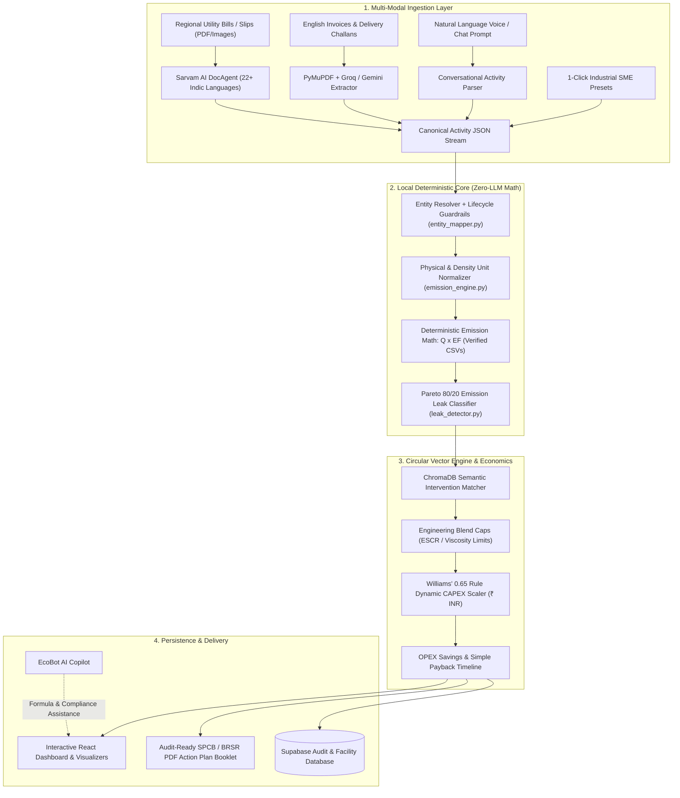
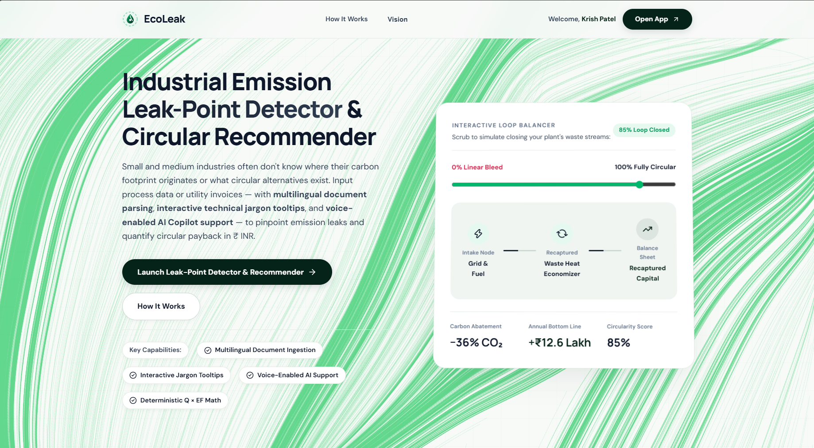
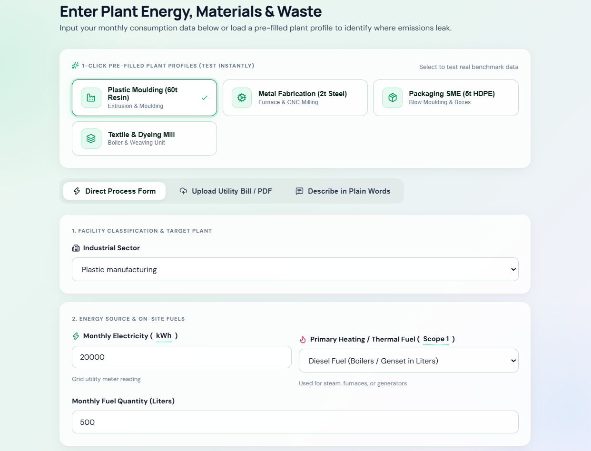

# EcoLeak — Industrial Emission Leak-Point Detector

<div align="center">


### Audit-Grade Industrial Decarbonization & Circular Economy Intelligence Platform for SMEs

[](https://fastapi.tiangolo.com)
[](https://reactjs.org/)
[](https://vitejs.dev/)
[](https://www.trychroma.com)
[](https://www.sarvam.ai/)
[](https://groq.com)
[](https://supabase.com)

[](LICENSE)

<p align="center">
  <strong>Pinpoint industrial carbon leaks. Enforce engineering-grounded circular substitutions. Model dynamic CAPEX/OPEX ROI in Indian Rupees (₹).</strong>
</p>

[Mission & Goals](#-mission--executive-summary) •
[System Architecture](#-system-architecture--deterministic-first) •
[Core Features](#-core-features) •
[Visual Product Tour](#-visual-product-tour) •
[Comparative Advantage](#-comparative-advantage) •
[API Reference](#-api-reference) •
[Quickstart](#-installation--local-setup)

</div>

---

## Mission & Executive Summary

Small and Medium Enterprises (SMEs) in plastics, metal fabrication, chemicals, and textiles generate over **40% of industrial emissions**, yet face crippling barriers when decarbonizing:

1. **The ₹5L–₹25L ESG Consulting Barrier:** Traditional environmental audits cost lakhs, take 6 to 8 weeks, and produce static slides with zero actionable day-to-day utility.
2. **Unstructured & Multilingual Shop-Floor Data:** Utility bills, diesel receipts, and scrap weighbridge slips are trapped on paper or written across regional Indian languages.
3. **The Danger of LLM Hallucinations:** Generative AI chatbots hallucinate emission factors, make basic arithmetic errors, and propose chemically incompatible substitutions that ruin machinery.

### The EcoLeak Solution & Impact
EcoLeak provides an **audit-ready, real-time industrial decarbonization platform** that delivers:
- **Instant Hotspot Discovery:** Isolates the vital 20% of operational inputs causing 80% of emissions via Pareto analysis in sub-3 seconds.
- **Feasible Circular Substitutions:** Recommends verified alternatives (PCR polymers, scrap regrind, bio-resins) bounded by strict mechanical caps (e.g., max 70% PCR for HDPE to prevent crack failure).
- **Localized Financial ROI (₹ INR):** Scales equipment CAPEX dynamically using **Williams' 0.65 Rule** and calculates real payback periods in months.
- **Indic Document Intelligence:** Extracts line items from invoices across 22+ Indian languages via Sarvam AI DocAgent and PyMuPDF.
- **Zero Hallucinations:** 100% of arithmetic and emission math is locked to local deterministic Python engines.

---

## System Architecture: "Deterministic First"

EcoLeak operates under an absolute architectural boundary:

> **CRITICAL INVARIANT:**  
> **LLMs are NEVER permitted to perform arithmetic, estimate emissions, compute financial ROI, or scale CAPEX.** LLMs are strictly confined to natural language comprehension and document extraction.



---

## Core Features

### 1. Multi-Modal & Multilingual Ingestion
- **Sarvam AI Indic DocAgent:** Native support for Indian language invoices, utility bills, and weight slips across Hindi, Marathi, Gujarati, Tamil, Telugu, Bengali, Kannada, and Punjabi.
- **Vision & PDF OCR:** High-throughput document parsing powered by Groq (`openai/gpt-oss-120b`) and PyMuPDF with Google Gemini fallback.
- **Conversational & Voice Extraction:** Transcribes plant operator voice or chat notes (*"We ran 18,000 kWh of grid power and 450 liters of diesel in the backup gen"*).
- **1-Click Industrial SME Benchmarks:** Instant profiles for **Plastic Injection Moulding (60t)**, **Metal Fabrication (2t Steel)**, **Packaging SME (5t HDPE)**, and **Textile & Dyeing Mills**.

### 2. Guardrailed Entity Resolution (`entity_mapper.py`)
- **Negative Lifecycle Filtering:** Terms containing `"waste"`, `"scrap"`, or `"effluent"` are strictly barred from resolving to virgin material emission factors.
- **5-Tier Disambiguation Pipeline:**
  1. *Exact Alias Lookup:* Normalized token matching across 35+ canonical activities.
  2. *Lifecycle Hinting:* Automatic routing between virgin, recycled, and scrap streams.
  3. *Semantic Vector Matching:* Local Hugging Face embeddings (`all-MiniLM-L6-v2`).
  4. *Constrained Groq Fallback:* Structured LLM disambiguation for unknown commercial names.
  5. *Data Quality Index (DQI):* Quantifies data fidelity and flags unmapped entries.

### 3. Pareto 80/20 Emission Leak Detection (`leak_detector.py`)
- Automatically sorts and isolates the critical 20% of inputs driving 80% of factory emissions ($Q \times EF$).
- Highlights immediate, high-leverage targets so plant managers don't waste capital on low-impact fixes.

### 4. ChromaDB Circular Interventions & Localized Economics (`circular_engine.py`)
- **ChromaDB Vector Matching:** Queries verified industrial intervention databases for circular alternatives.
- **Mechanical Integrity Guardrails:**
  - *HDPE:* Capped at **70% PCR** to prevent Environmental Stress Crack Resistance (ESCR) failure.
  - *PET:* Capped at **60% rPET** to prevent intrinsic viscosity drop in preforms.
  - *Metals:* Up to 100% scrap EAF recycling with flux normalization.
- **Williams' 0.65 Rule Dynamic CAPEX Scaling:**
  $$\text{CAPEX}_{\text{scaled}} = \text{Base CAPEX} \times \left(\frac{\text{Throughput}_{\text{facility}}}{\text{Capacity}_{\text{base}}}\right)^{0.65}$$
- **Indian Market Economics (₹ INR):** Real localized pricing for virgin resins (₹130/kg) vs PCR (₹95/kg), diesel (₹90/L), and grid power (₹7.50/kWh) with dynamic payback in months.

### 5. EcoBot AI — Operator Intelligence Copilot
- Integrated directly into the plant workflow bar and sidebar.
- Pre-loaded with official Indian regulatory formulas:
  - CEA National Grid Factor: `0.716 kg CO2e / kWh`.
  - Diesel Stoichiometric Density Conversion: `0.84 kg/L` density $\times$ `2.68 kg CO2e / L`.
  - SPCB Orange/Red Category Pollution Index thresholds.

### 6. Facility Profiles & Audit Persistence
- Manage multiple plant facilities with localized grid regions, annual capacities, and Consent to Operate (CTO) metadata.
- Automatic audit history persistence to Supabase with dual Firebase / Supabase JWT authentication.
- One-click export of an executive Decarbonization Action Plan booklet formatted for SPCB regulators, commercial green loans, and corporate supply-chain ESG reporting (SEBI BRSR).

---

## Visual Product Tour

<div align="center">

| 1. Dynamic Landing & Loop Balancer | 2. Plant Process Data Ingestion |
| :---: | :---: |
|  |  |
| *Simulate transition from linear waste bleed to 100% closed loop.* | *OCR document parsing, voice ingestion, and 1-click presets.* |

| 3. Pareto 80/20 Hotspot Detection | 4. Circular Solutions & ROI Simulator |
| :---: | :---: |
|  |  |
| *Identifies the critical 20% inputs causing 80% emissions.* | *Dynamic Williams' 0.65 CAPEX scaling and payback in ₹ INR.* |

| 5. Executive Decarbonization Action Plan | 6. EcoBot AI Copilot |
| :---: | :---: |
|  |  |
| *Audit-ready report for SPCB, BRSR, and green financing.* | *In-depth Indian regulatory compliance & engineering math.* |

</div>

---

## Comparative Advantage

| Dimension | Traditional ESG Audits | Generic LLM Wrappers | EcoLeak Platform |
| :--- | :--- | :--- | :--- |
| **Audit Cost** | ₹5,00,000 – ₹25,00,000 | ₹0 – ₹2,000 | **100% Free & Open-Source Core** |
| **Turnaround Time** | 4 – 8 Weeks | Instant (Unverified) | **Sub-3 Seconds (Deterministic)** |
| **Calculation Accuracy** | Audited Spreadsheets | Unreliable (Hallucinates Math) | **100% Deterministic Local Python Core** |
| **Data Ingestion** | Manual Entry by Consultants | Text Prompts Only | **Indic Invoices (Sarvam AI), PDFs, Voice, Presets** |
| **Engineering Boundaries**| Consultant Discretion | Ignored (Breaks Machines) | **Strict Mechanical Caps (70% PCR for HDPE)** |
| **Financial Localization**| High-Level USD/EUR | Uncalibrated USD Estimates | **Williams' 0.65 Rule & Dynamic ₹ INR Modeling** |
| **Hotspot Discovery** | Subjective Analysis | None | **Mathematical Pareto 80/20 Cumulative Ranking** |
| **Compliance Support** | Static Final Report | Generic Chat | **EcoBot Copilot (CEA, SPCB, BRSR, CBAM)** |

---

## Tech Stack

- **Backend:** FastAPI 0.115+, Uvicorn ASGI, Pydantic v2
- **Deterministic Math:** NumPy, Python Physical Dimensional Units Engine
- **Vector Database:** ChromaDB (Local Persistent Storage)
- **Multi-Modal AI:** Sarvam AI DocAgent (Indic Vision), Groq (`openai/gpt-oss-120b`), Google Gemini (`gemini-3.6-flash`), PyMuPDF
- **Embeddings:** Hugging Face Sentence Transformers (`all-MiniLM-L6-v2`)
- **Frontend:** React 18.3, Vite 6.2, Lucide React, Custom Cyber-Industrial CSS (Zero Tailwind bloat)
- **Database & Auth:** Supabase PostgreSQL, Firebase Admin SDK, PyJWT
- **Testing:** Pytest 8.3+, HTTPX, Starlette TestClient (121 automated tests)

---


## Installation & Local Setup

### Prerequisites
- **Python 3.10+** (Tested on 3.11 & 3.13)
- **Node.js 18+** & npm
- *(Optional)* `SARVAM_API_KEY` for Indic language invoice OCR
- *(Optional)* `GROQ_API_KEY` or `GEMINI_API_KEY` for natural language & PDF extraction
- *(Optional)* `SUPABASE_*` and `FIREBASE_*` for cloud persistence & authentication

### 1. Clone Repository & Setup Environment
```bash
git clone https://github.com/SalazarZ3U5/EcoLeak.git
cd EcoLeak
cp .env.example .env
```

### 2. Backend Setup
```bash
# Create and activate virtual environment
python -m venv .venv
.venv\Scripts\Activate.ps1       # Windows PowerShell
# source .venv/bin/activate      # macOS / Linux

# Install dependencies
pip install -r requirements.txt
```

### 3. Frontend Setup
```bash
cd frontend
npm install
cd ..
```

### 4. Launch Services
**Terminal 1 — Backend API (Port 8000):**
```bash
uvicorn backend.main:app --reload --port 8000
```

**Terminal 2 — Frontend Dev Server (Port 5173):**
```bash
npm run dev --workspace=frontend
```

Access the application at **`http://localhost:5173`**. Interactive API docs are available at **`http://localhost:8000/docs`**.

---

## Regulatory & Standards Alignment

- **GHG Protocol Corporate Standard:** Scope 1 (direct combustion), Scope 2 (grid electricity), and Scope 3 (purchased raw materials).
- **SEBI BRSR Core (India):** Tailored for SME suppliers reporting carbon intensity to India's top 1,000 listed anchor enterprises.
- **Central Electricity Authority (CEA India):** Uses the official Indian grid emission baseline (`0.716 kg CO2e / kWh`).
- **ISO 14064-1 Audit Traceability:** Transparent conversion logs with fuel specific gravity and density multipliers recorded for every line item.
- **EU CBAM Readiness:** Computes verified embedded carbon metrics for Indian exporters facing European carbon border adjustments.

---

## License

Distributed under the **MIT License**. See [LICENSE](LICENSE) for full terms.

<div align="center">
  <sub>Built for industrial resilience and SME circular decarbonization. Hackout 2026.</sub>
</div>
