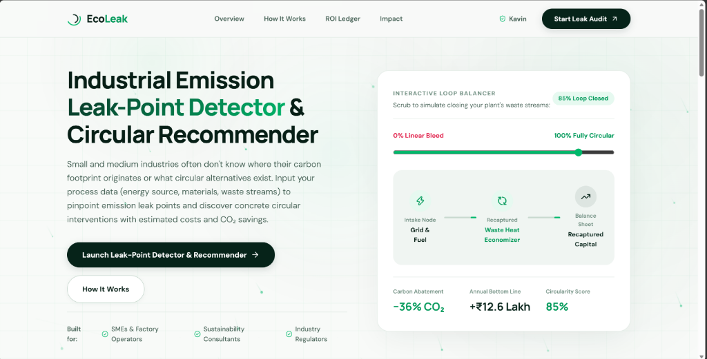
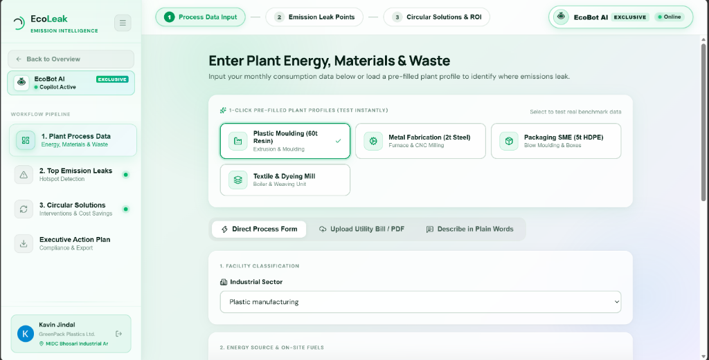
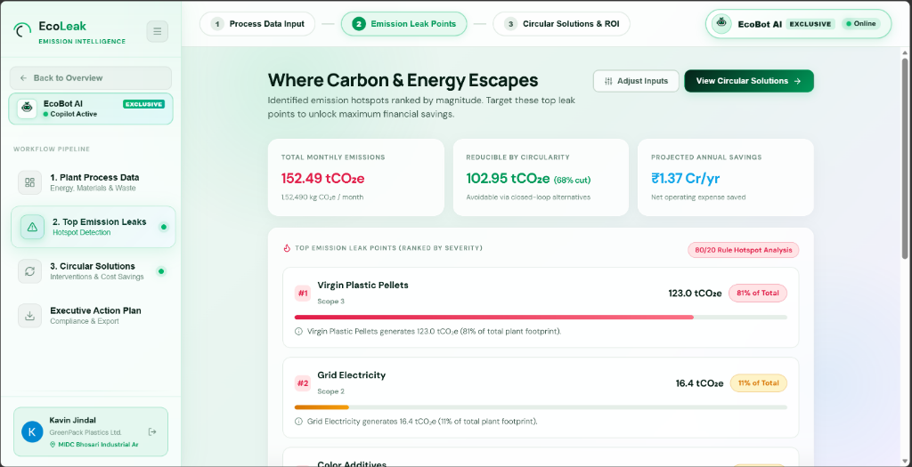
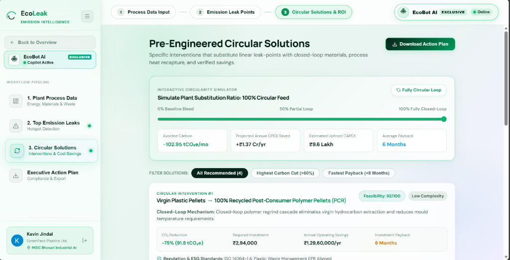
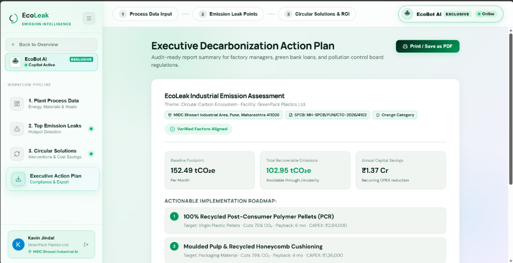
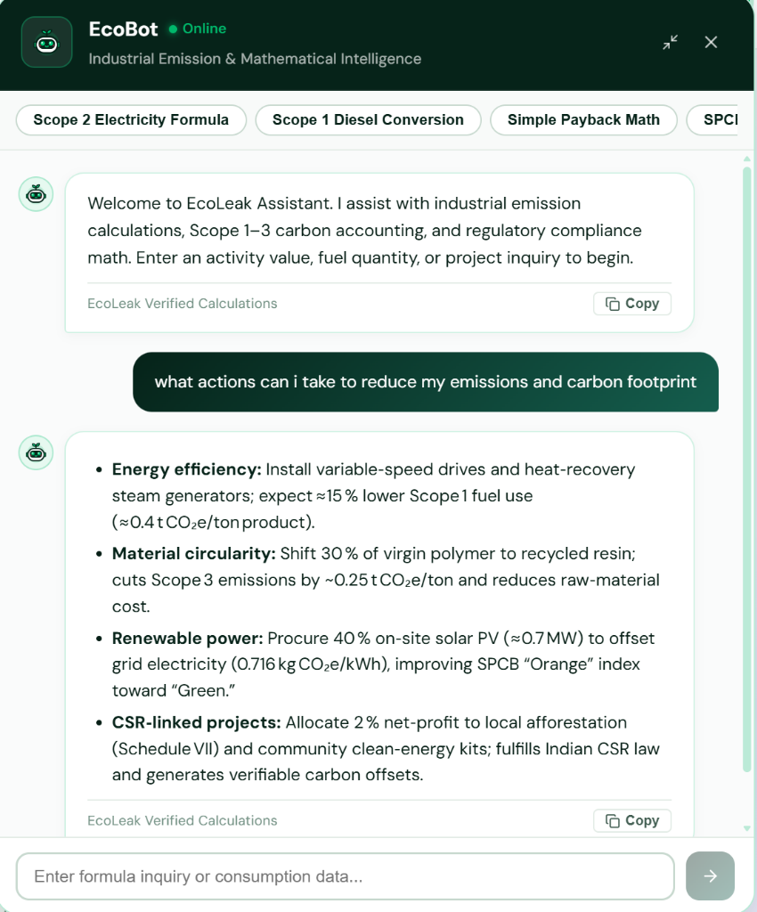
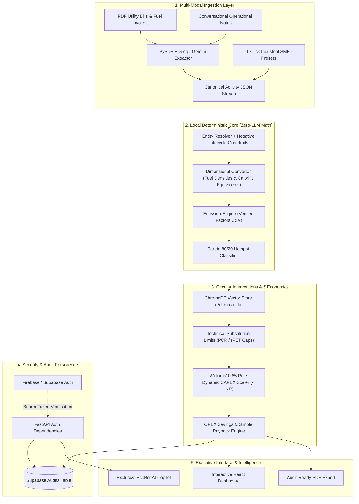

# EcoLeak — Industrial Emission Leak-Point Detector

<div align="center">



### Audit-Grade Industrial Decarbonization & Circular Economy Intelligence Platform for SMEs

[](https://fastapi.tiangolo.com)
[](https://reactjs.org/)
[](https://vitejs.dev/)
[](https://www.trychroma.com)
[](https://groq.com)
[](https://supabase.com)
[](https://firebase.google.com)
[](tests/)
[](LICENSE)

<p align="center">
  <strong>Pinpoint emission leak points across factory operations. Deliver engineering-grounded circular substitutions. Model dynamic CAPEX/OPEX ROI in Indian Rupees (₹).</strong>
</p>

[Explore System Architecture](#-system-architecture--deterministic-first) •
[Visual Product Tour](#-visual-product-tour) •
[EcoBot AI Copilot](#-ecobot-ai-copilot) •
[Technical Comparison](#-technical-comparison) •
[API Reference](#-api-reference) •
[Quickstart](#-installation--local-setup)

</div>

---

## 📌 Executive Summary

Small and medium-sized manufacturing facilities (plastics moulding, metal fabrication, packaging, textiles, and chemicals) generate over **40% of industrial greenhouse gas emissions**, yet they face structural hurdles when trying to decarbonize:

1. **The ₹5L–₹25L Consulting Barrier:** Big-4 environmental sustainability audits cost ₹5,00,000 to ₹25,00,000 and take 4 to 8 weeks—pricing out independent factory operators.
2. **Unstructured Operational Data:** SME energy and material data is trapped in paper utility bills, fuel delivery challans, and fragmented ERP spreadsheets.
3. **The Danger of LLM Hallucinations:** Generic generative AI solutions hallucinate emission factors, make basic mathematical errors, and recommend infeasible circular substitutions that cause polymer degradation or destroy machinery.

### The EcoLeak Solution
EcoLeak bridges this gap with a **Deterministic-First Architecture**:
- **Multi-Modal AI Ingestion:** PyPDF, Groq (`openai/gpt-oss-120b`), and Google Gemini (`gemini-3.6-flash`) parse messy bills, delivery slips, and natural conversational text.
- **100% Deterministic Local Math Core:** Zero LLMs perform arithmetic or select emission factors. Python physics engines compute Scope 1–3 emissions, identify Pareto 80/20 leak points, and apply Williams' 0.65 Rule to dynamically scale CAPEX and payback timelines in **Indian Rupees (₹ INR)**.
- **EcoBot AI Copilot:** An exclusive, authenticated operational assistant integrated directly above the factory workflow pipeline to assist plant managers with formula derivations, SPCB compliance thresholds, and substitution mechanics.

---

## 📸 Visual Product Tour

### 1. Interactive Landing & Loop Balancer
> Real-time circular loop balancer simulating the transition from linear waste bleed to 100% closed-loop manufacturing with projected ₹ Lakh bottom-line savings and carbon abatement.


---

### 2. Step 1 — Plant Process Data Ingestion
> Granular input of electricity, backup fuels, virgin polymers, metals, chemicals, and process scrap. Features 1-click SME factory benchmarks (Plastic Moulding, Metal Fabrication, Packaging SME, Textile Mill) alongside OCR PDF utility bill extraction and conversational prompt ingestion. Note the exclusive **EcoBot AI** launcher stationed directly on the workflow bar.



---

### 3. Step 2 — Pareto 80/20 Emission Leak-Point Detection
> Automatic isolation of the critical 20% of operational inputs driving 80% of factory emissions. Highlights dominant leak points (e.g. Virgin Plastic Pellets contributing 81% of footprint) with color-coded severity bars, total monthly emissions, and reducible circular fractions.



---

### 4. Step 3 — Pre-Engineered Circular Solutions & ROI Simulator
> Pre-engineered closed-loop substitutions retrieved from local ChromaDB vectors. Includes an interactive substitution slider (0% to 100% closed-loop) that dynamically scales upfront CAPEX via Williams' 0.65 Rule, calculates annual OPEX savings in ₹ Crore, and displays technical feasibility and mechanical complexity ratings.



---

### 5. Step 4 — Executive Decarbonization Action Plan
> Audit-ready executive report formatted for plant managers, green commercial loans, and state pollution control boards (SPCB / BRSR). Displays plant regulatory metadata (MIDC Bhosari, Pune, Consent to Operate CTO, Orange Category), verified Scope 1–3 footprints, and ranked engineering roadmaps with 1-click PDF export.



---

### 6. EcoBot AI — Exclusive Operator Intelligence Copilot
> Authenticated AI assistant exclusively accessible to verified factory operators. Resolves official Indian emission math (CEA grid electricity factors, diesel stoichiometric mass-to-volume density), explains SPCB Orange/Red category pollution index criteria, and guides circular polymer replacement ratios.

<div align="center">
  
</div>

---

## ⚖️ Technical Comparison

| Dimension | Traditional ESG Audits | Generic LLM Wrappers | EcoLeak Platform |
| :--- | :--- | :--- | :--- |
| **Audit Cost** | ₹5,00,000 – ₹25,00,000 | ₹0 – ₹2,000 | **100% Free & Open Source Core** |
| **Turnaround Time** | 4 – 8 Weeks | Instant (Unverified) | **Sub-3 Seconds (Deterministic)** |
| **Calculation Integrity** | Audited Spreadsheets | Unreliable (Hallucinates Math) | **100% Deterministic Local Python Engine** |
| **Data Ingestion** | Manual Consultant Entry | Prompt-Only Text | **PDF Invoices, ERP Slips, Plain Words, 1-Click Presets** |
| **Engineering Boundaries** | Varies by Consultant | Ignored (Breaks Equipment) | **Enforced Technical Caps (Max 70% PCR for HDPE)** |
| **Financial Localization** | Static Ballpark | USD Estimates | **Williams' 0.65 Rule & Dynamic ₹ INR Modeling** |
| **Hotspot Discovery** | Subjective Analysis | None | **Mathematical Pareto 80/20 Cumulative Ranking** |
| **Operator AI Copilot** | None | Generic Chatbot | **EcoBot AI: Formula & Compliance Gated Copilot** |
| **Regulatory Framework** | Manual Documentation | None | **SEBI BRSR Core, GHG Scope 1-3, ISO 14064-1, CEA India** |

---

## 🔬 System Architecture: "Deterministic First"

EcoLeak enforces an unbreachable boundary between language models and deterministic computation:

> **CRITICAL INVARIANT:**  
> **LLMs are NEVER permitted to execute arithmetic, select numerical emission factors, compute financial ROI, or scale CAPEX.**



---

## ⚡ Key Features & Engineering Modules

### 1. Multi-Modal Ingestion Layer
- **Utility Bill OCR (`/api/analyze/document`):** Ingests PDF utility bills, fuel invoices, and weighing slips using PyPDF and structured JSON extraction via Groq (`openai/gpt-oss-120b`) with Gemini fallback.
- **Conversational Copilot (`/api/analyze/chat`):** Translates operational descriptions (*"Our plant burned 500 liters of diesel and consumed 20,000 kWh of grid electricity"*) into standardized activity streams.
- **1-Click Industrial Benchmarks:** Instant operational profiles for:
  - **Plastic Moulding (60t Resin):** Injection moulding, color additives, sprue scrap.
  - **Metal Fabrication (2t Steel):** Heat treatment furnaces, CNC fluids, LPG, swarf.
  - **Packaging SME (5t HDPE):** Blow moulding, virgin HDPE, cardboard waste.
  - **Textile & Dyeing Mill:** Coal boilers, steam pipelines, process water, effluent.

### 2. Guardrailed Entity Resolution (`entity_mapper.py`)
- **Negative Lifecycle Filtering:** Prevents catastrophic classification errors. Terms containing tokens like `"waste"`, `"scrap"`, `"reject"`, or `"effluent"` are strictly barred from mapping to virgin material emission factors.
- **Five-Stage Resolution Pipeline:**
  1. *Exact Alias Lookup:* Normalized token matching against 35+ canonical activities.
  2. *Lifecycle Hint Disambiguation:* Routes virgin vs recycled vs post-industrial streams.
  3. *Semantic Vector Matching:* Local Hugging Face sentence transformers (`all-MiniLM-L6-v2`).
  4. *Constrained Groq Fallback:* Structured LLM disambiguation when novel terms appear.
  5. *Data Quality Index (DQI):* Explicitly flags unresolved inputs with remediation notes.

### 3. Pareto 80/20 Emission Leak Detection (`leak_detector.py`)
- Ranks activities by descending carbon intensity ($Q \times EF$).
- Isolates the top 20% of contributors driving 80% of total facility emissions.
- Visualizes linear bleed to ensure operators invest in high-leverage interventions first.

### 4. ChromaDB Circular Recommendations & Economics (`circular_engine.py`)
- **Vector Retrieval:** Queries a persistent local ChromaDB instance (`./chroma_db`) populated with verified industrial circular interventions.
- **Mechanical Substitution Limits:** Enforces physical caps to maintain mechanical integrity:
  - *HDPE:* Capped at **70% PCR** to prevent Environmental Stress Crack Resistance (ESCR) failure.
  - *PET:* Capped at **60% rPET** to prevent intrinsic viscosity drop.
  - *Steel:* 100% scrap EAF recycling permitted with flux adjustments.
- **Williams' 0.65 Rule for CAPEX Scaling:**
  $$\text{CAPEX}_{\text{actual}} = \text{Base CAPEX} \times \left(\frac{\text{Throughput}_{\text{facility}}}{\text{Capacity}_{\text{base}}}\right)^{0.65}$$
- **Localized Indian Economics (₹ INR):** Models real market rates for virgin polymers (₹130/kg) vs recycled PCR (₹95/kg), diesel (₹90/L), and grid power (₹7.50/kWh) with dynamic payback in months.

### 5. EcoBot AI — Operator Intelligence Copilot (`EcoBotChat.jsx`)
- **Workflow Pipeline Placement:** Positioned directly on the top workflow bar and sidebar above the pipeline steps—completely replacing intrusive floating widgets.
- **Authentication Gated:** Accessible strictly to verified plant operators authenticated through Firebase or Supabase.
- **Domain Expertise:** Pre-loaded with official Indian regulatory guidelines:
  - CEA Central Electricity Authority Grid Emission Factors (`0.716 kg CO2e / kWh`).
  - Stoichiometric diesel conversion (`0.84 kg/L` density $\times$ `2.68 kg CO2e / L`).
  - SPCB Pollution Index formulas (Orange Category: 41–59 score).
  - Clean energy kits and Schedule VII CSR carbon offset alignment.

### 6. Dual Authentication & Audit Persistence (`auth_service.py` & `supabase_service.py`)
- **Dual Token Verification:** Inspects incoming JWTs and validates against either **Firebase Admin SDK** or **Supabase Auth** (`supabase.auth.get_user`).
- **Audit History Database:** Automatically saves completed audit assessments to the Supabase `audits` table for authenticated users.
- **Non-Breaking Optional Auth:** Public access remains functional; logging in activates cloud persistence and unlocks EcoBot AI.

---

## 🛠️ Tech Stack

<div align="center">

| Layer | Technologies |
| :--- | :--- |
| **Frontend UI** | React 18.3, Vite 6.2, Lucide React, Custom Cyber-Industrial CSS (No Tailwind) |
| **Backend API** | FastAPI 0.115+, Uvicorn ASGI, Pydantic v2 |
| **Vector Store** | ChromaDB (Local Persistent Storage) |
| **Multi-Modal AI** | Groq SDK (`openai/gpt-oss-120b`), Google GenAI (`gemini-3.6-flash`), PyPDF |
| **Embeddings** | Hugging Face Sentence Transformers (`all-MiniLM-L6-v2`) |
| **Authentication** | Firebase Admin SDK, Supabase Python Client, PyJWT |
| **Cloud Database** | Supabase PostgreSQL (`audits` table) |
| **Testing** | Pytest 8.3+, HTTPX, Starlette TestClient (102 test cases) |

</div>

---

## 🗂️ Directory Map

```
EcoLeak/
├── backend/
│   ├── main.py                     # Lifespan, CORS, router mounting, static SPA serving
│   ├── api/
│   │   ├── analyze.py              # POST /api/analyze & /api/analyze/document (with auto-save)
│   │   ├── audits.py               # GET /api/audits & GET /api/audits/{id} (protected)
│   │   ├── chat.py                 # POST /api/analyze/chat (conversational ingestion)
│   │   ├── health.py               # GET /health (diagnostic telemetry)
│   │   └── recommendations.py      # POST /api/recommend (direct circular queries)
│   ├── models/
│   │   └── schemas.py              # Pydantic v2 request & response contracts
│   └── services/
│       ├── auth_service.py         # Dual Firebase / Supabase token verification & dependencies
│       ├── chroma_service.py       # ChromaDB vector store synchronization & querying
│       ├── circular_engine.py      # Williams' 0.65 rule, substitution caps, ₹ INR payback
│       ├── csv_loader.py           # Robust parsing of emission factor & intervention tables
│       ├── emission_engine.py      # Deterministic CO2e math & physical density conversions
│       ├── entity_mapper.py        # 5-stage entity resolution with lifecycle guardrails
│       ├── gemini_service.py       # Google Gemini 3.6 Flash fallback
│       ├── groq_service.py         # Primary Groq gpt-oss-120b extractor
│       ├── hf_service.py           # Local sentence transformers semantic fallback
│       ├── leak_detector.py        # Mathematical Pareto 80/20 cumulative classifier
│       └── supabase_service.py     # Supabase client & audit record persistence
├── chroma_db/                      # Persistent ChromaDB vector files
├── data/
│   ├── circular_interventions.csv  # Verified circular alternatives, CAPEX & base payback
│   └── emission_factors.csv        # Scope 1, 2, and 3 emission factor table
├── docs/
│   └── screenshots/                # High-resolution application screenshots
├── frontend/
│   ├── index.html                  # HTML5 application entry point
│   ├── package.json                # Frontend dependencies
│   ├── vite.config.js              # Vite configuration with API proxy to port 8000
│   └── src/
│       ├── App.jsx                 # View state coordinator (Landing, Dashboard, Auth)
│       ├── index.css               # Cyber-industrial design system (tokens, glassmorphism)
│       ├── components/
│       │   ├── AnimatedBackground.jsx # Canvas mesh and dynamic particle effects
│       │   ├── AuthPage.jsx           # Firebase & Supabase authentication modal
│       │   ├── Dashboard.jsx          # Core audit dashboard with interactive sections
│       │   ├── EcoBotChat.jsx         # Exclusive EcoBot AI assistant modal & math engine
│       │   ├── Hero.jsx               # Landing page hero with live loop balancer
│       │   ├── ImpactROI.jsx          # Projected carbon savings showcase
│       │   ├── Navbar.jsx             # Top bar with operator authentication indicators
│       │   ├── SimpleCalculator.jsx   # Quick interactive carbon estimator
│       │   ├── SimpleHowItWorks.jsx   # 3-step pipeline with exclusive EcoBot launcher
│       │   └── Ticker.jsx             # Real-time industrial telemetry ticker
│       └── services/
│           ├── api.js                 # API client with automatic Bearer token injection
│           ├── firebase.js            # Firebase Web client setup
│           └── supabase.js            # Supabase JS client setup
├── tests/                          # 102 automated unit and integration tests
├── .env.example                    # Environment variable configuration template
├── package.json                    # Monorepo root workspace config
├── requirements.txt                # Python backend dependencies
└── AGENTS.md                       # Strict architectural handbook for AI coding agents
```

---

## 🔌 API Reference

### 1. Structured Emission Analysis
- **`POST /api/analyze`**
- **Auth:** Optional (`Bearer <token>`). Automatically persists audit to Supabase when logged in.
- **Request Body:**
  ```json
  {
    "industry": "Plastic manufacturing",
    "activities": [
      { "name": "Grid Electricity", "quantity": 20000, "unit": "kWh" },
      { "name": "Diesel Fuel", "quantity": 500, "unit": "liters" },
      { "name": "Virgin HDPE Plastic", "quantity": 10000, "unit": "kg" }
    ]
  }
  ```
- **Response:**
  ```json
  {
    "facility_summary": { "total_co2e_kg": 37240.0, "total_co2e_tonnes": 37.24 },
    "scope_breakdown": { "scope_1_direct": 1340.0, "scope_2_electricity": 14320.0, "scope_3_indirect": 21580.0 },
    "leak_points": [
      { "rank": 1, "activity": "Virgin HDPE Plastic", "co2e_kg": 21580.0, "share_percent": 57.9, "is_pareto_hotspot": true }
    ],
    "circular_recommendations": [
      { "target_activity": "Virgin HDPE Plastic", "alternative": "Post-Consumer Recycled HDPE (PCR)", "estimated_capex_inr": 294000.0, "payback_months": 6 }
    ]
  }
  ```

### 2. Document Analysis (Invoices & Bills)
- **`POST /api/analyze/document`**
- **Payload:** `multipart/form-data` with `file` (PDF, PNG, JPG) and optional `industry`.
- **Behavior:** Runs PyPDF extraction + Groq LLM table parsing, then feeds line items directly into the deterministic calculation engine.

### 3. Natural Language Ingestion
- **`POST /api/analyze/chat`**
- **Request Body:** `{"message": "We burned 800L of diesel in our generator and ran 15,000 kWh from the Maharashtra grid."}`

### 4. Direct Circular Intervention Query
- **`POST /api/recommend`**
- **Request Body:** `{"material_key": "virgin_hdpe_plastic", "quantity_kg": 50000, "substitution_percent": 70}`

### 5. User Audit History (Protected)
- **`GET /api/audits`**
- **Auth:** Required (`Bearer <token>`). Returns paginated past audit runs for the authenticated operator.

### 6. Audit Detail (Protected)
- **`GET /api/audits/{audit_id}`**
- **Auth:** Required (`Bearer <token>`). Returns full JSON calculation snapshot for compliance re-generation.

### 7. Health & Diagnostic Check
- **`GET /health`**
- **Response:** `{"status": "ok", "vector_store": "ready", "primary_llm": "groq/gpt-oss-120b"}`

---

## 🚀 Installation & Local Setup

### Prerequisites
- Python 3.10+ (Tested on Python 3.11 & 3.13)
- Node.js 18+ & npm
- (Optional) `GROQ_API_KEY` for OCR parsing (`openai/gpt-oss-120b`)
- (Optional) Firebase Project ID & Supabase Project URL for authentication

### 1. Clone & Configure Environment
```bash
git clone https://github.com/SalazarZ3U5/EcoLeak.git
cd EcoLeak
cp .env.example .env
```

### 2. Backend Installation
```bash
# Create and activate virtual environment
python -m venv .venv
.venv\Scripts\Activate.ps1   # Windows PowerShell
# source .venv/bin/activate  # macOS / Linux

# Install dependencies
pip install -r requirements.txt
```

### 3. Frontend Installation
```bash
cd frontend
npm install
cd ..
```

### 4. Launch Services
In Terminal 1 (Backend API on port 8000):
```bash
uvicorn backend.main:app --reload --port 8000
```

In Terminal 2 (Frontend on port 5173):
```bash
npm run dev --workspace=frontend
```

Open **`http://localhost:5173`** in your browser.

---

## 🧪 Verification & Test Suite

The EcoLeak test suite covers **102 test cases** across all core mathematical engines, security boundaries, and API routes:

```bash
python -m pytest tests/ -v
```

```
============================== test session starts ==============================
collected 102 items

tests/test_api.py .........                                              [  9%]
tests/test_auth.py ......................                                 [ 31%]
tests/test_chroma.py .......                                             [ 38%]
tests/test_circular_engine.py ..........                                 [ 48%]
tests/test_csv_loader.py ............                                    [ 60%]
tests/test_emission_engine.py ............                               [ 72%]
tests/test_entity_mapper.py .................                            [ 89%]
tests/test_groq.py ........                                              [ 97%]
tests/test_leak_detector.py .....                                        [100%]

====================== 102 passed, 1 warning in 33.93s =======================
```

---

## 📜 Regulatory Framework Alignment

- **GHG Protocol Corporate Accounting Standard:** Full Scope 1 (direct combustion), Scope 2 (grid location-based), and Scope 3 (purchased goods & upstream logistics) boundary segregation.
- **SEBI Business Responsibility and Sustainability Reporting (BRSR):** Tailored for SME suppliers reporting carbon intensity to India's top 1,000 listed anchor companies.
- **Central Electricity Authority (CEA India):** Uses official national grid baseline emission factors (`0.716 kg CO2e / kWh`).
- **ISO 14064-1:** Traceable audit notes attached to every conversion (e.g., fuel specific gravity and volumetric density).
- **EU CBAM:** Prepares Indian manufacturing exporters with verified embedded carbon calculations.

---

## 📄 License

EcoLeak is licensed under the **MIT License**. See [LICENSE](LICENSE) for full details.

<div align="center">
  <sub>Built for industrial resilience and SME circular decarbonization. Hackout 2026.</sub>
</div>
