# EcoLeak — Industrial Emission Leak-Point Detector

[](https://fastapi.tiangolo.com)
[](https://reactjs.org/)
[](https://vitejs.dev/)
[](https://www.trychroma.com)
[](https://groq.com)
[](LICENSE)
[](tests/)

> **An audit-grade, AI-powered industrial decarbonization & circular economy platform tailored for Small and Medium Enterprises (SMEs).**  
> EcoLeak pinpoints high-impact carbon emission hotspots ("emission leak points") across factory operations and delivers engineering-grounded, financially viable circular economy alternatives with dynamic ROI modeling in Indian Rupees (₹).

---

## 📌 Table of Contents

1. [The Problem & Mission](#-the-problem--mission)
2. [Core Architecture & "Deterministic First" Design](#-core-architecture---deterministic-first-design)
3. [Key Features & Capabilities](#-key-features--capabilities)
4. [System Architecture Diagram](#-system-architecture-diagram)
5. [Tech Stack](#-tech-stack)
6. [Project Structure](#-project-structure)
7. [API Reference](#-api-reference)
8. [Installation & Setup](#-installation--setup)
9. [Verification & Testing](#-verification--testing)
10. [Regulatory & Compliance Alignment](#-regulatory--compliance-alignment)
11. [License](#-license)

---

## 🎯 The Problem & Mission

Small and medium-sized manufacturing facilities (plastics moulding, metal fabrication, packaging, textiles, chemicals) face severe challenges:
- **Stringent Regulations:** Mandates like SEBI BRSR (India), EU CBAM, GHG Protocol Scope 1–3 reporting, and ISO 14064.
- **Prohibitive Consulting Costs:** Big-4 environmental sustainability audits cost ₹5L–₹25L, pricing out SMEs.
- **Unstructured Factory Data:** Consumption data is trapped in paper utility bills, fuel delivery slips, and disparate ERP spreadsheets.
- **LLM Hallucinations:** Generic generative AI solutions hallucinate emission factors, invent math, and recommend infeasible circular substitutions that break manufacturing machinery.

### The EcoLeak Solution
EcoLeak bridges this gap by combining **multi-modal AI ingestion** (Groq / Gemini) with a **100% deterministic local physics and financial calculation engine**. It automates greenhouse gas accounting, identifies Pareto emission hotspots (the 20% of operations generating 80% of emissions), and calculates dynamic CAPEX/OPEX payback periods for transitioning to circular materials.

---

## 🔬 Core Architecture & "Deterministic First" Design

EcoLeak is built on a strict operational separation:

```
┌────────────────────────────────────────────────────────┐
│             Unstructured Ingestion Layer               │
│   (Groq gpt-oss-120b / Gemini 3.6 Flash / PyPDF)        │
│   • Natural Language Chat Parser                       │
│   • Utility Bill & Invoice Text Extractor              │
│   • Semantic Disambiguation                            │
└──────────────────────────┬─────────────────────────────┘
                           │ Canonical Activities (JSON)
                           ▼
┌────────────────────────────────────────────────────────┐
│            Local Deterministic Python Core             │
│   (Zero LLM Math — 100% Auditable Local Rules)         │
│   • Entity Resolver with Negative Lifecycle Filters    │
│   • Dimensional Validation & Density Unit Converters   │
│   • Emission Engine (Verified Factors CSV)             │
│   • Pareto 80/20 Leak-Point Hotspot Classifier         │
│   • ChromaDB Vector Store Interventions                │
│   • Williams' 0.65 Rule Dynamic CAPEX Scaler (₹ INR)   │
│   • Dynamic Payback & Technical Substitution Limits    │
└────────────────────────────────────────────────────────┘
```

1. **LLM Boundary:** Large Language Models are used **strictly** for natural language understanding and OCR/document extraction. They **never** calculate emissions, prices, or payback periods.
2. **Audit Trails:** Every unit conversion (e.g. converting Liters of diesel to mass using specific gravity `0.84 kg/L` or Natural Gas kWh to cubic meters `10.55 kWh/m³`) is logged with an explicit conversion rationale.
3. **Data Quality Index (DQI):** Quantifies confidence based on the proportion of verified mapped activities vs. unresolved inputs.

---

## ⚡ Key Features & Capabilities

### 1. Multi-Modal Activity Ingestion
- **1-Click Industrial Presets:** Instant loading of real-world SME operational profiles:
  - *Plastic Moulding (60t Resin)* — Extrusion, pellets, chillers, trim scrap.
  - *Metal Fabrication (2t Steel)* — Furnaces, CNC lubricants, LPG, steel swarf.
  - *Packaging SME (5t HDPE)* — Blow moulding, virgin HDPE, carton waste.
  - *Textile & Dyeing Mill* — Boilers, coal/steam, process water, packaging.
- **Smart Form Mode:** Granular input of electricity, fuels, virgin resins, metals, additives, water, and process waste.
- **Document & Invoice OCR (`/api/analyze/document`):** Direct upload of PDF utility bills, fuel delivery challans, and invoices parsed via PyPDF + Groq/Gemini.
- **Conversational Copilot (`/api/analyze/chat`):** Plain-language extraction (e.g. *"Our factory ran 20,000 kWh from the grid and burned 500L diesel last month"*).

### 2. Guardrailed Entity Resolution (`entity_mapper.py`)
- **Negative Lifecycle Filtering:** Prevents catastrophic mistakes such as mapping waste plastic or recycled HDPE to virgin resin factors.
- **Canonical Catalog:** 35+ verified industrial material, fuel, energy, and waste streams.
- **Hierarchical Fallback:** Exact alias matching → Category-constrained Hugging Face embeddings (`all-MiniLM-L6-v2`) → Groq LLM fallback → Explicit `UnresolvedActivity` with remediation advice.

### 3. Dimensional Validation & Physical Unit Conversion (`emission_engine.py`)
- Standardizes diverse metric and imperial units (`kg`, `tonnes`, `lbs`, `L`, `m³`, `kWh`, `MWh`, `GJ`).
- Cross-dimensional density and calorific conversions:
  - Petrol: `0.74 kg/L`
  - Diesel: `0.84 kg/L`
  - LPG: `0.54 kg/L` and `19 kg` industrial cylinder scaling
  - Natural Gas: `10.55 kWh/m³` net calorific value

### 4. Pareto (80/20) Leak-Point Hotspot Detection (`leak_detector.py`)
- Ranks emissions by descending carbon intensity.
- Detects **Primary Hotspots** (`share >= max(20%, 1.25 * uniform baseline)`) and **Secondary Hotspots** (`cumulative <= 80%` and `share >= 12%`).
- Categorizes operations into `High`, `Medium`, and `Low` risk tiers.

### 5. GHG Scope 1, 2, and 3 Disaggregation
- **Scope 1:** Direct combustion (Diesel generators, petrol, commercial LPG, natural gas).
- **Scope 2:** Purchased grid power (CEA India grid emission factor: `0.385 kg CO2e/kWh`).
- **Scope 3:** Upstream virgin materials (HDPE, PET, PP, LDPE, steel, aluminum, copper, glass, kraft paper, lubricants, masterbatch), water utility supply, wastewater discharge, and waste handling.

### 6. Circular Economy Engine & ChromaDB Vector Store (`circular_engine.py`, `chroma_service.py`)
- **ChromaDB Semantic Retrieval:** Vector store (`./chroma_db`) indexed with circular interventions and verified carbon offsets.
- **Technical Substitution Caps:** Enforces engineering boundaries (e.g., HDPE max 70% PCR to avoid environmental stress cracking; PET max 60% rPET to prevent intrinsic viscosity drop).
- **Williams' 0.65 Rule CAPEX Scaling:**
  $$\text{CAPEX} = \text{Base CAPEX} \times \left(\frac{\text{Facility Throughput}}{\text{Base Capacity}}\right)^{0.65}$$
- **Localized Financials (₹ INR):** Models actual virgin vs. recycled price deltas, annual OPEX savings, and real-time payback duration in months.
- **Interactive Substitution Sliders:** Adjust circular substitution levels live in the UI with dynamic recalculation of avoided emissions and ROI.

### 7. Executive Action Plan & Compliance Export
- One-click print-ready and PDF-exportable executive report.
- Formatted for auditor sign-off with facility details, Scope 1–3 breakdown, hotspot list, circular roadmap, and Data Quality Index.

### 8. Authentication & Multi-Tenant Access
- Integrated Firebase Authentication (Google OAuth + Email/Password).
- Supabase auth integration ready.
- Protected client-side routes preventing unauthenticated access to confidential plant operational data.

---

## 🏛 System Architecture Diagram

```mermaid
flowchart TD
    subgraph Client["Frontend (React 18 + Vite)"]
        UI["Cyber-Industrial UI / Dashboard"]
        Preset["1-Click Presets"]
        DocUp["Bill / PDF Upload"]
        Chat["Natural Language Chat"]
        Slider["Dynamic Circular Sliders"]
        Auth["Firebase / Supabase Auth"]
    end

    subgraph API["Backend Gateway (FastAPI)"]
        Router["API Router (/api)"]
        HealthEP["/health"]
        AnalyzeEP["/api/analyze"]
        DocEP["/api/analyze/document"]
        ChatEP["/api/analyze/chat"]
        RecEP["/api/recommend"]
    end

    subgraph AI["AI Ingestion & Entity Resolution"]
        Groq["Groq API (gpt-oss-120b)"]
        Gemini["Google Gemini 3.6 Flash"]
        HF["Hugging Face (all-MiniLM-L6-v2)"]
    end

    subgraph Core["Deterministic Calculation Core"]
        Mapper["Entity Mapper + Lifecycle Guardrails"]
        Converter["Physical Unit Converter (Density / Calorific)"]
        Engine["Emission Engine (data/emission_factors.csv)"]
        Pareto["Pareto Hotspot Detector (80/20 Rule)"]
        Circular["Circular Recommendation Engine"]
        Chroma["ChromaDB Vector Store (./chroma_db)"]
    end

    Client -->|HTTP / JSON / Multipart| API
    Router --> AnalyzeEP & DocEP & ChatEP & RecEP & HealthEP
    
    DocEP & ChatEP --> Groq
    Groq -.->|Fallback| Gemini
    
    AnalyzeEP & DocEP & ChatEP --> Mapper
    Mapper -.->|Semantic Fallback| HF
    Mapper -.->|LLM Fallback| Groq
    
    Mapper --> Converter --> Engine
    Engine --> Pareto
    Pareto --> Circular
    Circular <--> Chroma
    Circular --> Slider
    
    API -->|AnalyzeResponse JSON| UI
```



---

## 💻 Tech Stack

### Frontend
- **Framework:** React 18.3, Vite 6.2
- **Icons:** Lucide React
- **Styling:** Bespoke Cyber-Industrial CSS Design System (Dark theme, glassmorphism, responsive CSS grid, animated canvas mesh background)
- **Auth:** Firebase SDK 12.19 & Supabase JS 2.116

### Backend
- **Framework:** FastAPI, Uvicorn (ASGI)
- **Validation:** Pydantic v2
- **Vector Database:** ChromaDB 0.4+
- **Data Engine:** Pandas, NumPy
- **LLM Integrations:** Groq Python SDK, Google GenAI SDK
- **Embeddings & NLP:** Hugging Face Transformers, PyTorch, PyPDF
- **Testing:** Pytest, HTTPX

---

## 📂 Project Structure

```
EcoLeak/
├── backend/
│   ├── __init__.py
│   ├── main.py                     # FastAPI lifespan, CORS, router mounting, static React SPA serving
│   ├── api/
│   │   ├── __init__.py
│   │   ├── analyze.py              # /api/analyze & /api/analyze/document endpoints
│   │   ├── chat.py                 # /api/analyze/chat natural language endpoint
│   │   ├── health.py               # /health liveness and readiness probe
│   │   └── recommendations.py      # /api/recommend direct material lookup
│   ├── models/
│   │   ├── __init__.py
│   │   └── schemas.py              # Pydantic v2 models (AnalyzeRequest, AnalyzeResponse, etc.)
│   └── services/
│       ├── __init__.py
│       ├── chroma_service.py       # ChromaDB persistent collection sync & querying
│       ├── circular_engine.py      # Substitution caps, Williams' 0.65 rule, INR payback
│       ├── csv_loader.py           # Robust TSV/CSV data loader with whitespace normalization
│       ├── emission_engine.py      # Unit conversions & deterministic CO2e math
│       ├── entity_mapper.py        # 5-stage entity resolution with lifecycle filters
│       ├── gemini_service.py       # Google Gemini 3.6 Flash fallback
│       ├── groq_service.py         # Groq (openai/gpt-oss-120b) primary extractor
│       ├── hf_service.py           # Hugging Face sentence-transformers fallback
│       └── leak_detector.py        # Pareto 80/20 cumulative emission classifier
├── chroma_db/                      # Persistent local ChromaDB storage
├── data/
│   ├── circular_interventions.csv  # Verified circular alternatives, CAPEX, and baseline payback
│   └── emission_factors.csv        # Scope 1, 2, and 3 emission factors
├── docs/                           # Project documentation, pitch deck, and whitepapers
├── frontend/
│   ├── index.html                  # HTML5 entry point
│   ├── package.json                # Frontend dependencies
│   ├── vite.config.js              # Vite configuration with API proxy to port 8000
│   └── src/
│       ├── App.jsx                 # View state coordinator (landing / dashboard / auth)
│       ├── index.css               # Comprehensive cyber-industrial design system (78KB+)
│       ├── components/
│       │   ├── AnimatedBackground.jsx # Floating particles and canvas mesh
│       │   ├── AuthPage.jsx           # Firebase & Supabase authentication portal
│       │   ├── Dashboard.jsx          # Core audit dashboard with interactive sections
│       │   ├── Hero.jsx               # Landing page hero with animated stats
│       │   ├── ImpactROI.jsx          # ROI and carbon savings showcase
│       │   ├── Navbar.jsx             # Top navigation with auth indicators
│       │   ├── SimpleCalculator.jsx   # Quick interactive carbon estimation widget
│       │   ├── SimpleHowItWorks.jsx   # 3-step operational overview
│       │   └── Ticker.jsx             # Real-time industrial telemetry ticker
│       └── services/
│           ├── api.js                 # Frontend API client and INR formatters
│           ├── authConfig.js          # Authentication constants
│           ├── firebase.js            # Firebase Auth provider setup
│           └── supabase.js            # Supabase client setup
├── tests/
│   ├── test_api.py                 # FastAPI endpoint integration tests
│   ├── test_chroma.py              # ChromaDB vector store query tests
│   ├── test_circular_engine.py     # Payback, substitution limits & CAPEX scaling tests
│   ├── test_csv_loader.py          # Data loader integrity tests
│   ├── test_emission_engine.py     # Deterministic math & unit conversion tests
│   ├── test_entity_mapper.py       # Entity resolution & guardrail tests
│   ├── test_groq.py                # Groq extraction & mock tests
│   └── test_leak_detector.py       # Pareto hotspot classification tests
├── .env.example                    # Environment variables template
├── package.json                    # Monorepo root workspace config
├── requirements.txt                # Python backend dependencies
└── AGENTS.md                       # Comprehensive instructions for AI coding agents
```

---

## 🔌 API Reference

### 1. Structured Activity Analysis
- **`POST /api/analyze`**
- **Request:**
  ```json
  {
    "industry": "Plastic manufacturing",
    "activities": [
      { "name": "Grid Electricity", "quantity": 20000, "unit": "kWh" },
      { "name": "Diesel Fuel", "quantity": 500, "unit": "liters" },
      { "name": "Virgin HDPE Plastic", "quantity": 10000, "unit": "kg" }
    ]
  }
  ```
- **Response:**
  Returns `AnalyzeResponse` containing `facility_summary`, `scope_breakdown` (Scope 1, 2, 3), `activities` with audit notes, `leak_points` flagged by Pareto ranking, and `circular_recommendations` with scaled CAPEX and payback.

### 2. Document Analysis (Utility Bills & Invoices)
- **`POST /api/analyze/document`**
- **Payload:** `multipart/form-data` with `file` (PDF/TXT/Image) and optional `industry`.
- **Behavior:** Extracts text via PyPDF, parses line items with Groq/Gemini, and feeds extracted activities into the deterministic engine.

### 3. Natural Language Chat Analysis
- **`POST /api/analyze/chat`**
- **Request:**
  ```json
  {
    "message": "We consumed 30,000 kWh of grid power and used 2 tonnes of virgin steel billet this month."
  }
  ```

### 4. Direct Circular Recommendation
- **`POST /api/recommend`**
- **Request:**
  ```json
  {
    "material_key": "virgin_hdpe_plastic",
    "quantity_kg": 50000,
    "substitution_percent": 60
  }
  ```

### 5. Health & Diagnostic Check
- **`GET /health`**
- Returns backend status, ChromaDB sync status, and active LLM configuration.

---

## 🚀 Installation & Setup

### Prerequisites
- Python 3.10+
- Node.js 18+ and npm
- (Optional) Groq API Key or Google Gemini API Key

### 1. Clone & Configure
```bash
git clone https://github.com/SalazarZ3U5/EcoLeak.git
cd EcoLeak

# Copy environment templates
cp .env.example .env
```

Edit `.env` and provide your credentials:
```ini
GROQ_API_KEY=gsk_your_groq_api_key_here
GROQ_MODEL=openai/gpt-oss-120b

# Optional fallbacks
GEMINI_API_KEY=
HF_TOKEN=

# Firebase Web Auth credentials (for frontend)
VITE_FIREBASE_API_KEY=your_firebase_key
VITE_FIREBASE_AUTH_DOMAIN=your_app.firebaseapp.com
VITE_FIREBASE_PROJECT_ID=your_project_id
```

### 2. Backend Setup
```bash
# Create virtual environment
python -m venv .venv

# Activate virtual environment (Windows PowerShell)
.venv\Scripts\Activate.ps1
# On Linux/macOS: source .venv/bin/activate

# Install dependencies
pip install -r requirements.txt
```

### 3. Frontend Setup
```bash
cd frontend
npm install
cd ..
```

### 4. Running the Development Servers
In terminal 1 (Backend):
```bash
uvicorn backend.main:app --reload --port 8000
```

In terminal 2 (Frontend):
```bash
cd frontend
npm run dev
```
Open [http://localhost:5173](http://localhost:5173) in your browser. The frontend Vite server automatically proxies `/api` requests to `http://localhost:8000`.

---

## 🧪 Verification & Testing

EcoLeak includes an extensive automated test suite with **80 unit and integration tests** covering all modules:

```bash
# Run full test suite
python -m pytest -v
```

### Test Coverage Breakdown:
- **`tests/test_api.py` (9 tests):** API route integration, payload validation, health checks.
- **`tests/test_chroma.py` (7 tests):** ChromaDB document synchronization, semantic retrieval, metadata validation.
- **`tests/test_circular_engine.py` (10 tests):** Williams' 0.65 rule CAPEX scaling, substitution limits, payback math.
- **`tests/test_csv_loader.py` (12 tests):** Emission factor and circular intervention CSV parsing.
- **`tests/test_emission_engine.py` (12 tests):** Deterministic calculations, physical unit normalization, density conversions.
- **`tests/test_entity_mapper.py` (17 tests):** Lifecycle filters, exact matching, negative guardrails.
- **`tests/test_groq.py` (8 tests):** Groq client configuration, JSON response extraction, and prompt safety.
- **`tests/test_leak_detector.py` (5 tests):** Pareto 80/20 sorting and hotspot classification.

---

## 📜 Regulatory & Compliance Alignment

EcoLeak is designed to produce audit-ready data aligned with global environmental standards:
- **GHG Protocol Corporate Standard:** Formal categorization into Scope 1 (direct), Scope 2 (indirect energy), and Scope 3 (purchased goods & waste).
- **ISO 14064-1:** Traceable emission quantification with explicit unit conversion audit notes.
- **SEBI BRSR (Business Responsibility and Sustainability Reporting):** Enables Indian SMEs in supply chains of top 1,000 listed entities to disclose Scope 1 and Scope 2 figures seamlessly.
- **EU CBAM (Carbon Border Adjustment Mechanism):** Supports exporters in tracking embedded carbon in energy-intensive imports (steel, aluminum, polymers).

---

## 📄 License

This project is licensed under the MIT License — see the [LICENSE](LICENSE) file for details.
